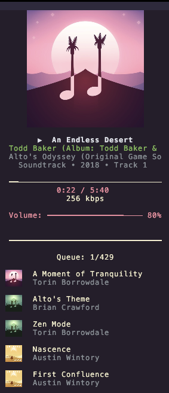
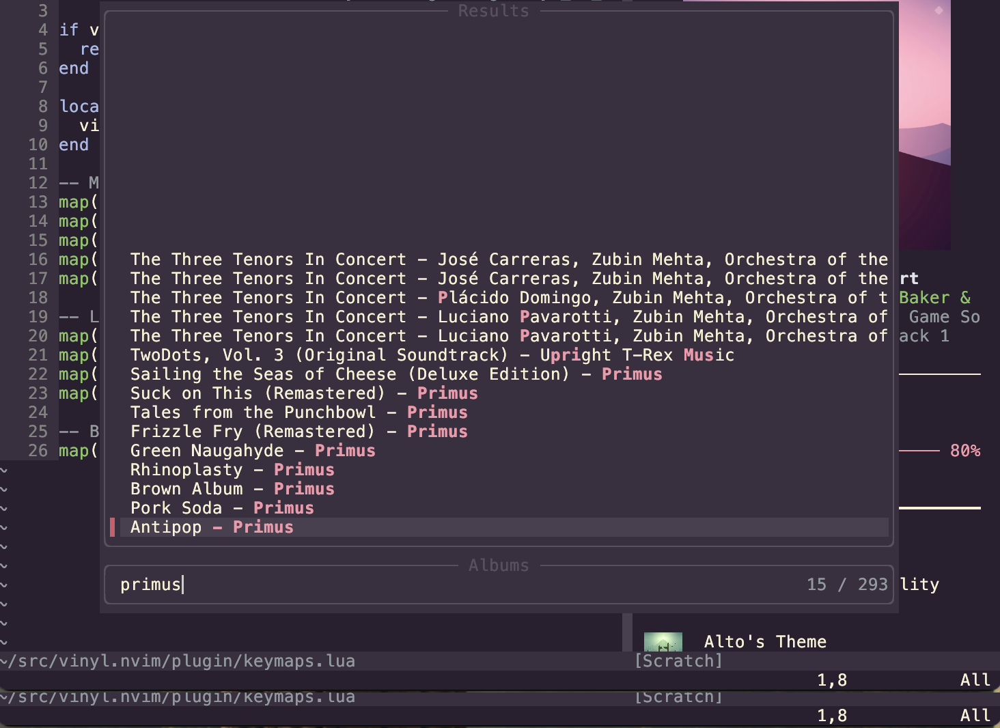
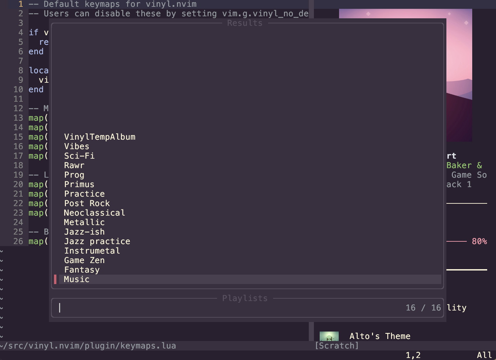

# vinyl.nvim

A music controller for Neovim with support for **Apple Music** and **Spotify**.



## Features

- **Multiple backends**: Apple Music (macOS) and Spotify (cross-platform)
- **Docked UI** with track info, progress bar, and album artwork
- **Library browsing** via Telescope, fzf-lua, or `vim.ui.select`
- **Playback controls**: play/pause, next/prev, shuffle, seeking, volume
- **Album artwork** via Kitty graphics protocol

## Requirements

- Neovim 0.8+
- **Apple Music**: macOS (works out of the box)
- **Spotify**: Premium account + [OAuth app credentials](#spotify-setup)
- **Artwork**: Kitty terminal (optional)

Run `:checkhealth vinyl` to verify your setup.

## Installation

```lua
-- lazy.nvim
{
  "yourusername/vinyl.nvim",
  config = function()
    require("vinyl").setup()
  end,
  keys = {
    { "<leader>mm", "<cmd>Vinyl toggle<CR>", desc = "Music: Toggle UI" },
    { "<leader>m<Space>", "<cmd>Vinyl play<CR>", desc = "Music: Play/pause" },
  },
}
```

Default keymaps use `<leader>m` prefix. Disable with `vim.g.vinyl_no_default_keymaps = true`.

## Quick Start

### Apple Music

Just open the UI — no setup needed:

```vim
:Vinyl toggle
```

### Spotify Setup

1. Run `:Vinyl spotify-login`
2. Create an app at [developer.spotify.com/dashboard](https://developer.spotify.com/dashboard):
   - Set Redirect URI to `http://127.0.0.1:8888/callback`
   - Enable "Web API"
3. Enter your Client ID and Client Secret when prompted
4. Authorize in your browser (redirects back automatically)

## Usage

```vim
:Vinyl              " Toggle UI
:Vinyl play         " Play/pause
:Vinyl next         " Next track
:Vinyl shuffle      " Toggle shuffle
:Vinyl albums       " Browse albums
:Vinyl backend      " Show/switch backend
```

Type `:Vinyl <Tab>` for all commands. See `:help vinyl-commands` for details.

### Library Browsing

Browse your library with Telescope, fzf-lua, or `vim.ui.select`:

|  |  |
|:---:|:---:|
| `:Vinyl albums` | `:Vinyl playlists` |

## Keymaps

### Default Global Keymaps

| Key | Action |
|-----|--------|
| `<leader>m<Space>` | Play/pause |
| `<leader>mm` | Toggle UI |
| `<leader>mn` | Next track |
| `<leader>mN` | Previous track |
| `<leader>ms` | Toggle shuffle |
| `<leader>mp` | Browse playlists |
| `<leader>ma` | Browse albums |
| `<leader>mt` | Browse tracks |
| `<leader>mr` | Browse artists |
| `<leader>mb` | Show backend |

Disable with `vim.g.vinyl_no_default_keymaps = true` before the plugin loads.

### UI Keymaps

When the vinyl window is open:

| Key | Action |
|-----|--------|
| `q` / `<Esc>` | Close UI |
| `<Space>` | Play/pause |
| `n` / `N` | Next / previous track |
| `h` / `l` | Seek ±5 seconds |
| `H` / `L` | Seek ±30 seconds |
| `=` / `-` | Volume up / down |
| `s` | Toggle shuffle |
| `?` | Show help |

Customize via `keymaps.ui` in setup. Set a key to `""` to disable it:

```lua
require("vinyl").setup({
  keymaps = {
    ui = {
      play_pause = "p",      -- Change to 'p'
      close = { "q" },       -- Remove <Esc>
      show_help = "",        -- Disable help
    },
  },
})
```

## Documentation

Full documentation is available via `:help vinyl`:

- `:help vinyl-configuration` — All setup options
- `:help vinyl-commands` — Command reference
- `:help vinyl-keymaps` — Keymap reference
- `:help vinyl-backends` — Backend details
- `:help vinyl-highlights` — Theming
- `:help vinyl-api` — Lua API

## Roadmap

- [ ] Repeat mode control
- [ ] Queue navigation
- [ ] Playlist management
- [ ] Lyrics display
- [ ] Statusline integration

## License

Apache 2.0
